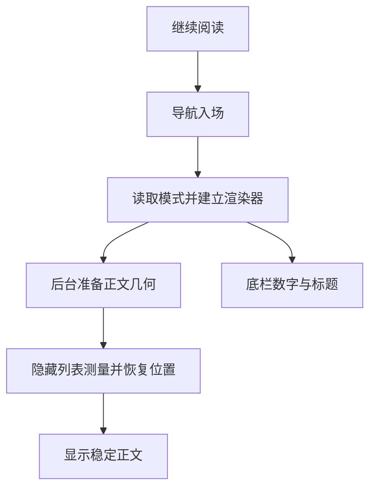
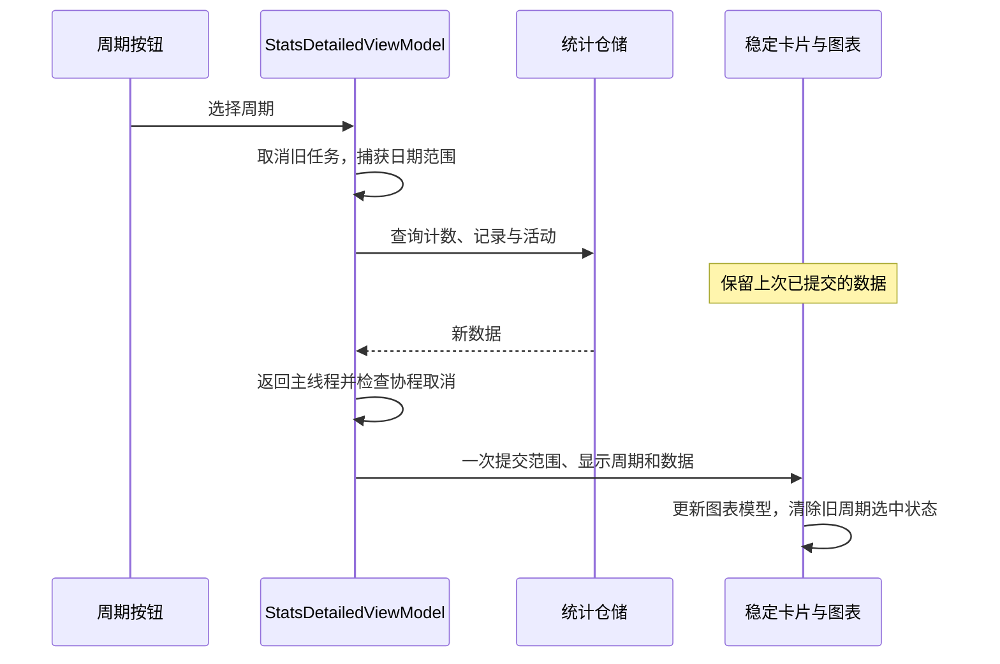

# 界面更新、闪烁与卡顿排查

本文记录非 TTS 界面的更新审查方法与本轮结论，供后续开发判断哪些重建必须保留、哪些工作可以减少。阅读器更细的布局与恢复约束见 [reader-ui-updates.md](reader-ui-updates.md)。录屏、设备配置、数据库、临时探针与原始 trace 不进入仓库。

## 先区分三种现象

| 现象 | 优先检查 | 不能直接推断 |
| --- | --- | --- |
| 封面、文字短暂变空后重新出现 | 组合身份、冷流重订阅、加载分支、旧内容是否被提前清除 | 不能仅凭闪烁认定图片网络慢。 |
| 内容变小、位移、切换后再跳一次 | 导航与内部动画叠加、SizeTransform、恢复位置及系统栏变化 | `boundsInWindow` 可能受导航裁剪影响，不等于实际测量宽度变化。 |
| 拖动或入场停顿 | doFrame 的组合、布局、绘制、JIT 锁及调度等待 | 协程在 IO 上执行不代表其结果发布和后续 UI 工作没有成本。 |

修复顺序是先保证请求与内容正确，再减少可确定的无效工作，最后用同条件样本判断耗时。不要靠清空旧画面、延迟正文一帧、缓存 Placeable 或降低保存频率制造“更快”的表象。

## 两条已确认的链路

### 阅读入场

[Issue #631](https://github.com/Renakoni/nextvol/issues/631) 对应详情页继续阅读。

- 导航与首次正文内部的延迟淡入、缩放、尺寸动画曾同时存在。首次渲染器直接采用最终尺寸，仍保留用户主动切换阅读模式的过渡。
- 只隐藏绘制并不会停止组合。章节占位符在中央加载遮罩后仍创建加载动画，属于可以直接去掉的重复工作；保留占位高度和恢复屏障。
- 阅读加载指示使用普通圆形指示器，避免首次组合反复构造复杂形状动画。此调整限定在阅读器，不全局替换应用加载样式。
- 两个三位滚动数字原本预建约 120 个文字节点。底栏改用固定宽度的普通数字立即更新，位数变化不推动标题，隐藏的宽度占位不暴露给无障碍服务。
- JIT 锁会落在测字或组合函数内部。不能把整段墙钟耗时都归因于函数算法；减少节点和去掉过渡也不能保证消灭冷启动 JIT 尖峰。

### 统计详情

[Issue #632](https://github.com/Renakoni/nextvol/issues/632)、[PR #633](https://github.com/Renakoni/nextvol/pull/633) 对应详情入场及周期切换。

周期是数据选择，活动卡、时长图和详情卡仍是同一块内容。三套列表分支合并为稳定条目；按书籍 ID 复用页面内信息流，避免周期切换重新创建封面订阅。首次图表直接显示，后续数据短暂过渡。保留图表 host 后必须显式清除旧 marker 和下钻状态，否则相同 x 会被误当成新周期的选择。

`selectedViewIndex` 表示用户请求，`displayedViewIndex` 与日期范围表示已提交结果；不能拿新选择去解释尚未替换的旧数据。取消请求还必须阻止迟到结果发布，只有按钮高亮变化不足以证明切换正确。

## 全局静态扫描与重点审查

扫描覆盖 UI 中的 AnimatedContent、Crossfade、animateContentSize、key、列表身份与冷流订阅，再沿以下页面和数据入口审查。真机定量对照集中在阅读入场、统计详情；其他页面的代码审查和冒烟不能替代每个状态的帧测量。

| 区域与代码入口 | 发现与处理判断 |
| --- | --- |
| `ui/navigation/NavHost.kt`、`utils/Anim.kt` | 导航本身已有入场动画。先检查是否与内部首次内容过渡叠加，不统一关闭导航动画。 |
| `ui/home/reading/home/ReadingHomeScreen.kt` / `ReadingHomeViewModel.kt` | 最近阅读行以书 ID 为 key；资料流在列表变化时构造。列表重排或增删时订阅可能重启，但没有本轮可重复闪烁证据，不增加全局缓存。 |
| `ui/home/bookshelf/home/BookshelfHomeContent.kt` | 列表与网格保留书籍 key、分别持有滚动状态；卡片 Crossfade 的目标包含资料结果，频繁元数据更新是后续候选，需要先复现同一本书更新时是否反复淡入。 |
| `ui/home/discovery/DiscoveryResultsScreen.kt`、`SourceBrowseControls.kt` | resetId、来源范围和页号用于有意重置结果与标签滚动。去掉 key 会混淆新旧来源位置，保留。 |
| `ui/home/explore/search/SearchHubScreen.kt`、`SearchScopeSheet.kt` | 结果资料流身份与 preview 分工明确；来源筛选页的 key 用于新查询回到顶部。保留这些语义，不能把所有 key 都视为闪烁源。 |
| `ui/home/explore/search/ExploreSearchScreen.kt` | 旧搜索页面对历史和建议使用逐项 AnimatedContent；删除首项或快速更新建议值得后续复现。尚未量化该路径，不扩大为本轮重构。 |
| `ui/home/settings/sources/SourcesScreen.kt`、`SourceConfigurationSheet.kt` | 已通过 contentKey 按页面身份保留组合；普通状态更新并不等于整页重新播放动画。 |
| `ui/bookmanager/BookManagerScreen.kt`、`LocalBookManagerScreen.kt` | 下载和本地书籍条目已有稳定 key；底部详情切换和清理状态过渡具有业务含义。未发现本轮已复现的周期式整页重建。 |
| `ui/storagemanager/StorageUsageChart.kt`、`ui/book/detail/DetailScreen.kt` | 布局动画对应统计详情展开或简介展开；是否过重取决于数据量与频率，不能据函数名批量删除。 |
| `ui/components/Cover.kt`、`ZoomableAsyncImage.kt` | 图片请求按内容身份记忆，重试 key 有明确含义。正文图片从占位高度变为实际高度仍是重排风险，应以长图、缓存未命中及位置恢复场景单独验证。 |
| `ui/components/AnimatedText.kt`、`SettingsEntry.kt` | 按字符动画会放大高频数字更新成本。本轮只调整已确认热点；设置滑块与统计概览日期保留，待实测再处理。 |
| `ui/components/Filter.kt` | 两处用 AnimatedContent 只过渡颜色，看起来可疑，但当前应用源码未找到该扩展组件的调用入口。不给不可达候选写“性能修复”，也不顺手清理遗留文件。 |

TTS 功能、服务及其专项性能验证不在本轮范围；不处理开放的 TTS Issue。

## 后续排查的最小闭环

1. 写出可复现触发：例如“周视图选最后一天，然后切到年”，不要只写“优化动画”。
2. 验证业务身份：请求、章节、周期、图片或来源是否变化；UI 应保留哪个对象，应该重置哪段交互状态。
3. 在 trace 中找到实际帧和函数。隐藏组件仍可能组合、测量；只看重组次数不够。
4. 用针对性的测试检查旧结果、恢复屏障、订阅身份、数字位数等可确定行为；真实 Canvas 手势与动画要补真机核验。
5. 将入场、退出、跨章分开统计。预热次数、录屏开关、构建类型、数据、浮窗和设备条件一致，冷样本与暖样本不能混用。
6. 同时看录屏中的空白、位移和内容正确性。主线程 doFrame 只是帧工作的一部分，完整呈现时序看 FrameTimeline，触控延迟另测。
7. 修改去掉临时跟踪后再测。有限样本支持局部收益，不能宣称全应用稳定满帧。

当前不建议引入统一页面状态框架或全局禁用动画。后续优先级是复现剩余长帧中的具体节点创建、独立评估发行构建的 JIT/AOT 状态，以及验证正文图片高度变化；每项有证据后再开独立问题。
